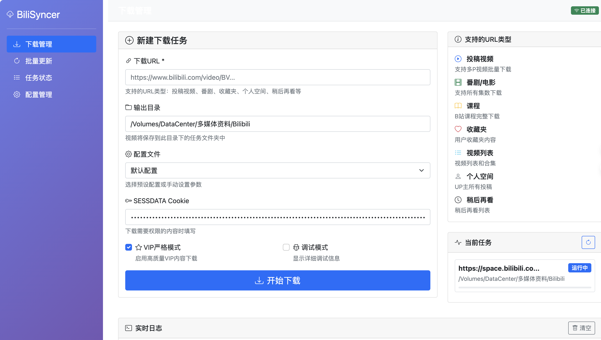
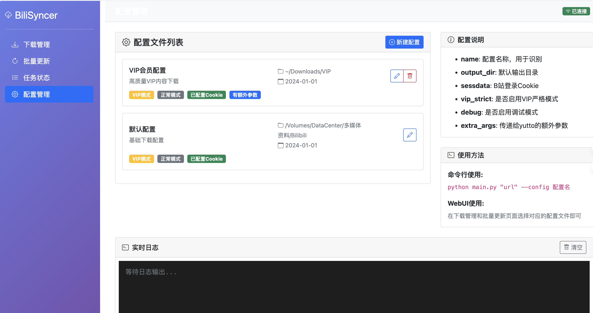

# BiliSyncer

🎯 **Intelligent Bilibili Content Synchronization Tool** - Batch download, resume support, and incremental updates

[](https://python.org)
[](LICENSE)
[](webui)

[🇨🇳 中文文档](README_ZH.md) | 🇺🇸 English

## 🌟 Project Overview

BiliSyncer is a professional Bilibili content synchronization tool focused on batch downloading and intelligent management. Built on top of `yutto`, it provides a complete batch download solution with support for resume downloads, incremental updates, and web interface management.

## ✨ Core Features

### 📺 Comprehensive Content Support
- **User Videos** - Single videos or complete series
- **Anime & Movies** - Automatically fetch all episodes
- **Favorites** - Batch download favorite collections
- **User Space** - All works from uploaders
- **Courses** - Bilibili paid courses
- **Collections** - Complete video series

### 🔄 Intelligent Sync Mechanism
- **Resume Downloads** - Automatically resume interrupted downloads
- **Incremental Updates** - Download only new content
- **Status Tracking** - CSV file-based download status management
- **Batch Updates** - One-click update for all tasks

### 🎨 User Experience
- **Web Interface** - Intuitive graphical operations
- **Real-time Monitoring** - Live download progress display
- **Configuration Management** - Flexible YAML configuration system
- **Cross-platform Support** - Compatible across platforms

## 📱 Interface Preview

### Download Management

*Main download interface with real-time progress tracking*

### Batch Updates

*Batch update interface for managing multiple download tasks*

### Task Status

*Comprehensive task status overview with detailed information*

### Configuration Management

*Easy-to-use configuration management interface*

## 🚀 Quick Start

### Requirements

- Python 3.8+
- yutto (Original Bilibili download tool)

### Installation

```bash
# 1. Install dependencies
pip install yutto
pip install -r requirements.txt

# 2. Start Web Interface
python start_webui.py

# 3. Or use command line
python main.py "https://www.bilibili.com/video/BV1xx411c7mD"
```

### Basic Usage

#### Web Interface
Visit `http://localhost:port` to use the graphical interface for batch downloading and management.

#### Command Line Interface
```bash
# Download single video
python main.py "https://www.bilibili.com/video/BV1xx411c7mD"

# Download favorites
python main.py "https://space.bilibili.com/123456/favlist?fid=789012" -c "SESSDATA"

# Batch update all tasks
python main.py --update -o "/path/to/downloads" -c "SESSDATA"

# Use configuration file
python main.py "URL" --config default
```

## 📁 Project Structure

```
BiliSyncer/
├── main.py              # Command line entry point
├── start_webui.py       # Web interface launcher
├── batch_downloader.py  # Batch download engine
├── extractors.py        # URL parser
├── config/              # Configuration files
│   ├── default.yaml     # Default configuration
│   └── vip.yaml         # VIP configuration example
├── utils/               # Utility modules
│   ├── csv_manager.py   # Status management
│   ├── logger.py        # Logging system
│   └── config_manager.py # Configuration management
├── webui/               # Web interface
│   ├── app.py           # Flask application
│   ├── templates/       # Template files
│   └── static/          # Static resources
└── api/                 # API interfaces
    └── bilibili.py      # Bilibili API
```

## 🔧 Configuration

### Configuration File Format
```yaml
name: "Configuration Name"
description: "Configuration Description"
output_dir: "~/Downloads"
sessdata: "your_sessdata_here"
vip_strict: true
debug: false
extra_args: ["--quality", "8K"]
```

### Getting SESSDATA
1. Login to bilibili.com
2. Open Developer Tools (F12)
3. Go to Application → Cookies
4. Copy the value of `SESSDATA`

## 🎯 Use Cases

- **Content Creators** - Backup your own works
- **Learning Materials** - Download courses and tutorials
- **Collection Management** - Batch download favorite collections
- **Series Following** - Automatically update anime/series content
- **Resource Organization** - Systematically manage video resources

## 🔄 Update Mechanism

BiliSyncer's intelligent update mechanism:
1. **Status Detection** - Scan downloaded content
2. **Content Comparison** - Check for new videos
3. **Incremental Download** - Download only new content
4. **Status Sync** - Update download records

## 🛠️ Tech Stack

- **Core** - Python 3.8+
- **Download Engine** - yutto
- **Web Framework** - Flask + SocketIO
- **Frontend** - Bootstrap 5
- **Configuration** - PyYAML
- **Async Processing** - asyncio

## 📊 Performance Features

- **Concurrent Processing** - Multi-task parallel support
- **Memory Optimization** - Low memory footprint
- **Network Optimization** - Intelligent retry mechanism
- **Storage Optimization** - Avoid duplicate downloads

## 🤝 Contributing

We welcome Issues and Pull Requests. Please ensure:
- Follow existing code style
- Add appropriate tests
- Update relevant documentation

## 📜 License

This project is licensed under the MIT License. See [LICENSE](LICENSE) file for details.

## 🙋‍♂️ Support & Feedback

For questions or suggestions, please contact us through:
- Submit an [Issue](issues)
- Start a [Discussion](discussions)

---

⭐ If this project helps you, please give it a Star! 